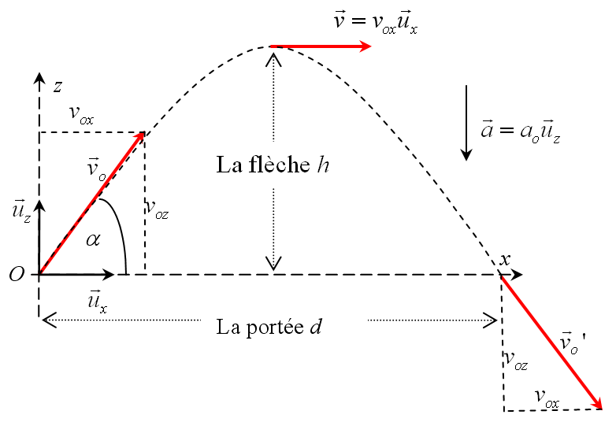

# Les fonctions en Python (exercices)

**Consignes :**  les exercices ci-dessous seront à rendre en un unique fichier nommé `exo_fonctions.py` en respectant bien le nom demandé pour chacunes des fonctions. Il est important de rédiger les `docstrings` et d'ajouter quelques `doctests`.

### Exercice 1

Ecrire une fonction `carre()` qui prend un paramètre `n` (entier) et qui en retourne le carré.

### Exercice 2

Ecrire une fonction `polynome()` qui prend un paramètre `x`  (entier) et qui retourne le résultat du calcul de x^2 + 2x + 10 sous forme d'un entier.

### Exercice 3

Ecrire une fonction `polynome2()` qui prend trois paramètres `a, b, c` (entiers), un paramètre `x` (flottant) et qui retourne le résultat du calcul de a*x^2 + b*x + c

### Exercice 4

Ecrire une fonction `celcius_to_fahrenheit()` qui prend en paramètre un entier temp_celcius et qui retourne la température convertie en degré fahrenheit sous la forme d'un entier.

<u>On donne :</u> temp_fahrenheit = (temp_celcius × 9/5) + 32

Ecrire ensuite une fonction `fahrenheit_to_celcius()` qui fait le travail inverse.

<u>On donne :</u> temp_cel,cius = (temp_fahrenheit - 32) × 5/9

**Remarque :** On pourra discuter des  avantages et/ou inconvénients de mettre le résultat de la conversion sous la forme d'un entier.

### Exercice 5

Ecrire une fonction `surface_disque()` qui prend :

* un paramètre `r` (float)  qui correspond au rayon du disque

* un paramètre `unite` (string) qui correspond à l'unité de mesure (m, cm, mm)

La fonction doit retourner la surface du disque en précisant l'unité qui a été donnée en paramètre **sous la forme d'une chaine de caractères** de la forme : "La surface du disque est de 3.14 m carré".

**Remarque :** 

* il peut être utile d'importer pi du module math avec `from math import pi`

* pour arrondir un flottant à deux chiffres après la virgule, on peut utiliser `round(valeur, 2)` où valeur est le flottant et 2 le nombre de chiffres après la virgule.

### Exercice 6

Ecrire une fonction `parite()` qui prend en paramètre un nombre entier n et qui retourne un booléen de valeur True si n est pair et False sinon.

**Remarque :** le programme doit s'interrompre si n n'est pas un entier, l'instruction `isinstance(var, type)` retourne un booléen qui indique si la variable `var` est bien du type indiqué.

### Exercice 7

Ecrire une fonction `tirage_au_sort()` qui prend en paramètre deux entiers a et b, et retourne cinq nombres entiers au hasard compris entre a et b (inclus).

Il est conseillé d'utiliser la fonction `randint()` du module `random` en faisant un l'import nécessaire.

**Remarque :** le programme doit s'interrompre si a et b ne sont pas des entiers sinon la fonction `randint()` va vous rappeller à l'ordre ;-).

### Exercice 8

Le tir parabolique (ou tir balistique) consiste propulser un projectile à partir d'un point (ici O) avec une vitesse initiale v0 et un angle alpha.



La portée du tir parabolique est donnée par la relation d = (v0^2 * sin (2*alpha)) / g où g est l'intensité de la pesanteur (9,8 N/kg).

Ecrire une fonction `portee()` qui prend en paramètre v0 (float) qui correspond à la vitesse initiale, alpha (float) qui correspond à l'angle de tir en degré et qui retourne la portée du tir.

### Exercice 9

Ecrire une fonction `triangle()` qui prend en paramètre un entier `taille` et qui trace une triangle équilatéral avec des côtés de longueur `taille` avec Turtle.


**Reamrque :** pour les plus avancés, réflechir à une fonction qui permet de dessiner des triangles de taille variable en les plaçant avec des coordonnées (x,y) se basant sur l'angle en bas à gauche.

### Exercice 10

La méthode pour résoudre une équation d'une équation du second degré est décrite sur le site [http://math.lyceedebaudre.net/premiere-sti2d/second-degre/resoudre-une-equation-du-second-degre](http://math.lyceedebaudre.net/premiere-sti2d/second-degre/resoudre-une-equation-du-second-degre)

Ecrire une fonction `equation()` qui prend trois paramètres `a, b, c` (entiers) correspondant aux coefficients de l'équation a*x^2 + b*x + c = 0 et qui retourne les solutions (éventuelles) sous forme de chaîne de caractères.

On obtiendra :

```python
>>> equation(1, 2, 1)
'une solution : -1.0'
>>> equation(2, 5, 2)
'deux solutions : -0.5 et -2.0'
>>> equation(2, 2, 2)
'pas de solution'
```
