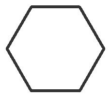
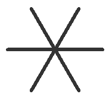
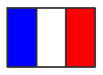

# Premiers pas avec Python (exercices)

### Exercice 1

Dans la zone du `shell`, saisissez l'instruction ci-dessous, validez, et ajoutez le résultat juste après la ligne `# on obtient`.

```python
>>> print("Hello World !")

 # on obtient
 Hello World !
```

### Exercice 2

Dans la fenêtre nommée `<untitled>`, saisissez l'instruction ci-dessous :

```python
print("Hello World !")
```

 Enregistrez votre programme dans votre dossier personnel avec le nom `affichage.py`, puis lancez votre programme à l'aide de l'icone en forme de fleche (ou utilisez `F5`).

Observez le résultat et l'ajouter ci-dessous :

```python
# on obtient
Hello World !
```

### Exercice 3

Qu'affichent les instructions suivantes ?

```python
>>> print("1+")
1+

>>> print(1+)
Traceback (most recent call last):
  File "H:\Travail\NSI\Python\exercice.py", line 1
    print(1+)
            ^
SyntaxError: invalid syntax
```

### Exercice 4

Observez les résultats suivants donnés par l'interpréteur Python :

```python
>>> 5 - 3 - 2
0
>>> 1 / 2 / 2
0.25
>>> 6 / 3 * 2
4.0
```

Qu'en déduire sur la manière dont sont interprétés les soustractions et les divisions enchainées ?

```python
Python les fait dans l'ordre des priorités. Pour l enchainement des
soustractions et des divisions, il les fait dans l'ordre.
```

Faire les calculs suivants pour justifier votre proposition.

```python
>>> (5 - 3) - 2
0
>>> 5 - (3 - 2)
4.0
>>> (1 / 2) / 2
0.25
>>> 1 / (2 / 2)
1.0
>>> (6 / 3) * 2
4.0
>>> 6 / (3 * 2)
1.0
```

### Exercice 5

Quelle est la valeur affichée par l'interprèteur après la séquence d'instructions suivante ?

```python
>>> a = 3
>>> a = 4
>>> a = a + 2
>>> a
6
```

### Exercice 6

Quelle est la valeur affichée par l'interprèteur après la séquence d'instructions suivante ?

```python
>>> a = 2
>>> b = a * a
>>> b = a * b
>>> b = b * b
>>> b
64
```

### Exercice 7

Dans le shell, initialiser une variable a avec la valeur 2.

Puis répéter dix fois l'instruction : a = a * a. 

Observez le résultat. Quelle puissance de 2 a-t-on calculée ?

```python
# on obtient
On obtient 179769313486231590772930519078902473361797697894230657273430081157732675805500963132708477322407536021120113879871393357658789768814416622492847430639474124377767893424865485276302219601246094119453082952085005768838150682342462881473913110540827237163350510684586298239947245938479716304835356329624224137216
La puissance de 2 est 1024
```

### Exercice 8

En utilisant la bibliothèque `math` de Python :

* calculez la racine carré de 5

* afficher la valeur de pi

* calculez le sin de pi/2

* convertir 45° en radian

Si besoin consulter la documentation de Python : [https://docs.python.org/fr/3.7/library/math.html](https://docs.python.org/fr/3.7/library/math.html)

```python
# import de la bibliothèque math
import math
# calcul de racine carré de 5
math.sqrt(5)
# affichage de pi
print(math.pi)
# calcul du sinus de pi/2
math.sin(math.pi/2)
# conversion de 45° en radian
math.radians(45)
```

### Exercice 9

Déterminez le type des variables suivantes (indiquez les instructions utilisées)

```python
>>> a = "Les variables"
>>> b = 3125
>>> c = 5.68

# vos réponses...
>>> type(a)
<class 'str'

>>> type(b)
<class 'int'

>>> type(c)
<class 'float'>>>
```

### Exercice 10

Que se passe-t-il quand on éxécute le programme suivant ? Le rectifier si nécessaire.

```python
a = input("saisir un nombre : ")
print("le nombre suivant est :", a+1)

# on obtient
saisir un nombre : 1
Traceback (most recent call last):
  File "H:\Travail\NSI\Python\exercice.py", line 2, in <module>
    print("le nombre suivant est :", a+1)
TypeError: can only concatenate str (not "int") to str
# version rectifiée éventuelle
a = int(input("saisir un nombre : "))
print("le nombre suivant est :", a+1)
# on obtient alors 
saisir un nombre : 1
le nombre suivant est : 2:
```

### Exercice 11

Écrire un programme qui demande son prénom à l'utilisateur puis l'affiche sous la forme "bonjour, Adrien" (si Adrien est le prénom entré par l'utilisateur).

Enregistrez votre programme sous le nom `prenom.py` dans votre dossier personnel après avoir vérifier le bon fonctionnement et copier-coller le code ci-dessous.

```python
### ici votre programme ###
prenom = input("Quel est votre prénom ?")
print("Bonjour", prenom)
# on obtien
Quel est votre prénom ?Adrien
Bonjour Adrien
```

### Exercice 12

Ecrire un programme qui demande à l'utilisateur les longueurs (entières) des deux côtés d'un rectangle et affiche son aire.

Enregistrez votre programme sous le nom `surface_rectangle.py` dans votre dossier personnel après avoir vérifier le bon fonctionnement et copier-coller le code ci-dessous.

```python
### ici votre programme ###
longueur = int(input("Quel est la longueur du rectangle ?"))
largeur = int(input("Quel est la largeur du rectangle ?"))
aire = longueur*largeur
print(str(aire))

# on obtient
Quel est la longueur du rectangle ?2
Quel est la largeur du rectangle ?3
6
```

### Exercice 13

Ecrire un programme qui demande à l'utilisateur d'entrer un nombre de secondes et qui l'affiche sous la forme d'heures/minutes/secondes.

Enregistrez votre programme sous le nom `secondes_heures.py` dans votre dossier personnel après avoir vérifier le bon fonctionnement et copier-coller le code ci-dessous.

```python
### ici votre programme ###
secondes = int(input("Entrez un nombre de secondes."))
minutes = secondes * 60
heures = minutes * 60

print(str(secondes))
print(str(minutes))
print(str(heures))
# on obtient
Entrez un nombre de secondes.1
1
60
3600
```

### Exercice 14

Écrire un programme qui demande l'âge de l'utilisateur. Si l'utilisateur a 18 ans ou plus, le programme devra afficher « Bonjour, vous êtes majeur». Si l'utilisateur a moins de 18 ans, le programme devra afficher « Bonjour, tu es mineur.»

Enregistrez votre programme sous le nom `majeur_mineur.py` dans votre dossier personnel et copier-coller le code ci-dessous

```python
### ici votre programme ###
age = int(input("Quel est votre âge ?"))

if (age >= 18):
    print("Bonjour, vous êtes majeur.")
else:
    print("Bonjour, tu es mineur.")

# on obtient
Quel est votre âge ? 18
Bonjour, vous êtes majeur.

Quel est votre âge ?17
Bonjour, tu es mineur.
```

### Exercice 15

Écrire un programme permettant de créer "un générateur automatique de punition" : le programme demande à l'utilisateur d'entrer la phrase à recopier et le nombre de fois où la phrase devra être recopiée.

Par exemple :

```python
Entrez la phrase à recopier : "Je ne dois pas discuter en classe"
Combien de fois la phrase est à recopier ? 3
# on obtient
"Je ne dois pas discuter en classe"
"Je ne dois pas discuter en classe"
"Je ne dois pas discuter en classe"
```

Une fois au point , votre programme sera enregistré sous le nom `punition.py`dans votre dossier personnel et le code recopié ci-dessous.

```python
### ici votre programme ###
punition = input("Entrez la phrase à recopier.")
nombre_punition = int(input("Combien de fois la phrase est à recopier ?"))

for _ in range(nombre_punition):
    print(punition)
# on obtient
Entrez la phrase à recopier. Je ne dois pas discuter en classe
Combien de fois la phrase est à recopier ?3
 Je ne dois pas discuter en classe
 Je ne dois pas discuter en classe
 Je ne dois pas discuter en classe
```

### Exercice 16

Écrire un programme permettant d'afficher une table de multiplication. L'utilisateur entre la table qu'il désire (de 1 à 9), le programme permet alors d'afficher la table demandée.

Par exemple si l'utilisateur demande la table des 3, le programme devra afficher :

        1 x 3 = 3
        2 x 3 = 6
        ...
        ...
        10 x 3 = 30

Une fois au point , votre programme sera enregistré sous le nom `multiplication.py`dans votre dossier personnel et le code recopié ci-dessous.

```python
### ici votre programme ###
table_multiplication = int(input("Entrer une table de multiplication entre 1 et 9."))

if(table_multiplication > 9):
    input("Vous devez entrer une table de multiplication entre 1 et 9.")
else:
    i = 0
    for i in range(1, 11):
        table = i * table_multiplication
        print(str(table))

# on obtient
Entrer une table de multiplication entre 1 et 9.3
1 x 3 = 3
2 x 3 = 6
3 x 3 = 9
4 x 3 = 12
5 x 3 = 15
6 x 3 = 18
7 x 3 = 21
8 x 3 = 24
9 x 3 = 27
10 x 3 = 30
```

### Exercice 17

Ecrire un programme qui demande un entier n à l'utilisateur, puis calcule le résultat de la multiplication 2 x 2 x 2 x ... x 2 (où n est le nombre d'occurences de 2).

Une fois au point , votre programme sera enregistré sous le nom `2x2.py`dans votre dossier personnel et le code recopié ci-dessous.

```python
### ici votre programme ###
n = int(input("Entrer un entier."))
valeur = 2
for _ in range(n-1):
    valeur = valeur * 2
print(valeur)
# on obtient

Entrer un entier.2
4

Entrer un entier.3
8
```

### Exercice 18

Ecrire un programme qui demande à l'utilisateur une somme initiale s a déposer sur un livret, un taux d'intérêts annuel t exprimé en pourcents et un nombre d'années n, et qui affiche les intérêts perçus chaque année ainsi que le montant total présent sur le livret après n années.

Indication : il faut ajouter à s la quantité s * t / 100

Une fois au point , votre programme sera enregistré sous le nom `livret.py`dans votre dossier personnel et le code recopié ci-dessous.

```python
### ici votre programme ###
somme = int(input("Rentrer une somme initiale."))
taux = int(input("Rentrer un taux d'intérêts annuel."))
annee = int(input("Rentrer un nombre d'années."))

montant = annee*(somme+(somme*taux/100))

print("Il y a", montant, "€ sur le livret après", année, "an(s).")(s).")
```

### Exercice 19

Ecrire un programme qui demande une année à l'utilisateur et qui indique s'il s'agit d'une année bissextile.

On rappelle qu'une année est bissextile si elle est multiple de 4 mais pas multiple de 100, ou si elle est multiple de 400.

Une fois au point , votre programme sera enregistré sous le nom `bissextile.py`dans votre dossier personnel et le code recopié ci-dessous.

```python
### ici votre programme ###
annee = int(input("Rentrer une année."))

if (annee % 4 == 0 and annee % 100 != 0) or annee % 400 == 0:
    print(annee, "est une année bissextile.")
else:
    print(annee, "n'est pas une année bissextile.")
```

### Exercice 20

Reproduire les figures suivantes avec turtle, recopiez le programme utilisé et l'enregistrez sous le nom `figure.py` où figure sera rectangle, hexagone, flocon...

**Remarque :** Il faut utiliser une boucle `FOR` si une partie du programme se répète !


```python
### pour le rectangle ###
from turtle import *

forward(100)
right(90)
forward(50)
right(90)
forward(100)
right(90)
forward(50)
```



```python
### pour un hexagone ###
for _ in range(6):
    left(60)
    forward(100)
```



```python
### pour un flocon ###

```


```python
### pour les trois triangles ###
```


```python
### pour la croix sur carré noir ###
```


```python
### pour le Yin Yang ###
```



```python
### pour le drapeau français ###
```
