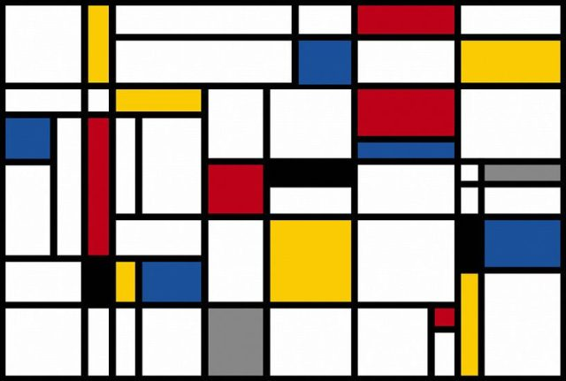
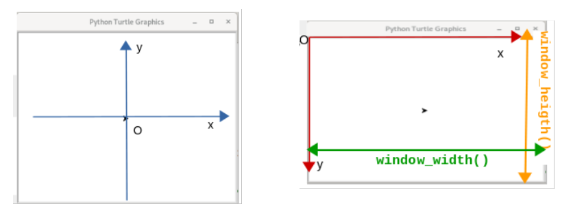
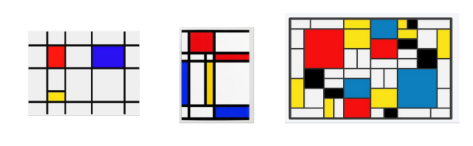
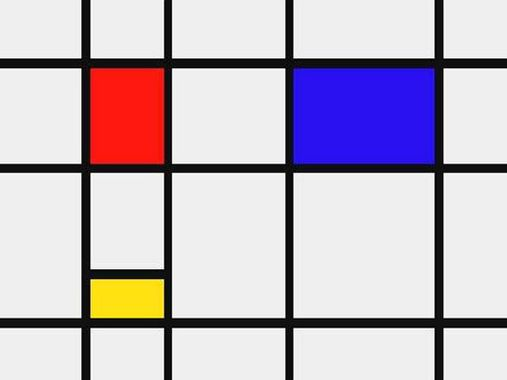

# Art-eShow

Art-eShow ( à prononcer à l'anglaise...) est un projet artistique qui a pour but de (re)produire des peintures d'art moderne



## 1- Objectif

Ecrire des fonctions de dessin et les utiliser pour reproduire des peintures d'art moderne ou pour créer des peintures "à la manière de Mondrian". 

### 2- Proposition de démarche

### 2.1- Maîtriser le module turtle de Python

Les (re)productions de peintures peuvent être réalisées avec le **module turtle** de Python. 

Pour découvrir le module Turtle de Python, lire le document https://zestedesavoir.com/tutoriels/944/a-la-decouverte-de-turtle/

Le système de coordonnées utilisé par défaut dans le module Turtle est identique à celui utilisé en mathématiques. Mais en informatique, il est d'usage d'avoir l'origine au coin supérieur gauche de la fenêtre (ou de l'écran) et l'axe y orienté vers le bas :



Pour travailler avec ce système de coordonnées, on donne la fonction **position_en(x, y, orientation = 0)** :

```python
import turtle

def position_en(x, y, orientation = 0):
    """ fonction (en fait une procédure) qui place
    la tortue en un point x,y repéré par rapport au coin supérieur gauche
    et l'oriente selon la valeur de orientation
    :param x,y:  (int) les coordonnées où placer la tortue
    :param orientation: (int) 0 = Est ; 90 = Nord; 180 = Ouest ; 270 = Sud ;
    """
    turtle.penup()
    turtle.setposition(x - turtle.window_width()//2, turtle.window_height()//2 - y)
    turtle.setheading(orientation)
    turtle.pendown()
```

### 2.2 - Peindre "à la manière de Mondrian"

Piet Mondrian , né le 7 mars 1872 à Amersfoort (Pays-Bas) et mort le 1er février 1944 à New York, est un peintre néerlandais reconnu comme l'un des pionniers de l'abstraction.

Vous pouvez consulter sa page WikiPédia afin de découvrir cet artiste : [Piet Mondrian — Wikipédia](https://fr.wikipedia.org/wiki/Piet_Mondrian)

Voici quelques exemples de toiles qu'il a réalisées :



A l'aide d'un logiciel de dessin (comme Gimp), nous allons étudier la composition de gauche de Mondrian :



Pour cela, vous disposez du fichier [mondrian.jpg](mondrian.jpg) ayant un format de 507 sur 380 pixels.

**Repérer les éléments graphiques qui composent le tableau de gauche de Mondrian en ayant comme objectif de le reproduire par programmation**

### 2.3.  Programmer un tableau "à la Mondrian"

**Pour programmer un tableau "à la Mondrian", on va vous demander de créer les fonctions suivantes capables de tracer :**

* Une ligne horizontale sur **toute la largeur** de la fenêtre : **ligne_h()** qui prendra 3 paramètres :
  
  * l'ordonnée y à laquelle cette horizontale est tracée
  
  * l’épaisseur du trait (par défaut fixé à 10 pixels)
  
  * la couleur du trait (par défaut en noir)

```python
def ligne_h(y, epaisseur = 10, trait='black'):
    """ procédure pour tracer une ligne horizontale
    :param y: (int) l'ordonnée de la ligne (par rapport au coin supérieur gauche)
    :param epaisseur: (int) l'épaisseur du trait en pixel
    :param trait: (str) la couleur du trait
    # code de la fonction à écrire
```

* Une ligne verticale sur **toute la hauteur** de la fenêtre : **ligne_v()** qui prendra 3 paramètres :
  
  * l’abscisse x à laquelle cette horizontale est tracée
  
  * l’épaisseur du trait (par défaut fixé à 10 pixels)
  
  * la couleur du trait (par défaut en noir)

```python
def ligne_v(x, epaisseur = 10, trait='black'):
    """ procédure pour tracer une ligne horizontale
    :param x: (int) l'abscisse de la ligne (par rapport au coin supérieur gauche)
    :param epaisseur: (int) l'épaisseur du trait en pixel
    :param trait: (str) la couleur du trait
    """"
    # code de la fonction à écrire
```

* Un rectangle coloré entouré d'une bordure noir : **rectangle()** qui prendra 7 paramètres :
  
  * les coordonnées x1 et y1 du coin supérieur gauche du rectangle
  
  * les coordonnées x2 et y2 du coin inférieur droit du rectangle
  
  * la couleur de remplissage du rectangle
  
  * l'épaisseur du trait (par défaut fixé à 10 pixels)
  
  * la couleur du trait (par défaut en noir)

```python
def rectangle(x1, y1, x2, y2, couleur = "red", epaisseur = 10, trait = 'black'):
    """ procédure pour tracer un rectangle coloré entouré d'un trait
    :param x1, y1: (int) les coordonnées du coin supérieur gauche du rectangle
    :param x2, y2: (int) les coordonnées du coin inférieur droit du rectangle
    :param couleur (string) couleur de remplissage du rectangle (rouge par défaut)
    :param epaisseur: (int) l'épaisseur du trait en pixel (10 px par défaut)
    :param trait: (str) la couleur du trait (noir par défaut)
    """
    # code de la fonction à écrire
```

### 2.4. Créer le tableau

Ecrire un programme qui **reproduit exactement** le dessin du fichier [mondrian.jpg](mondrian.jpg) :


Ce programme s’appuiera sur les fonctions : **position_en( ), rectangle( ), ligne_h( ) et ligne_v( )**...

Pour les plus avancés, modifier le programme pour que les couleur des rectangles puissent être changées aléatoirement au lancement du programme et/ou reproduire le tableau ci-dessous :


