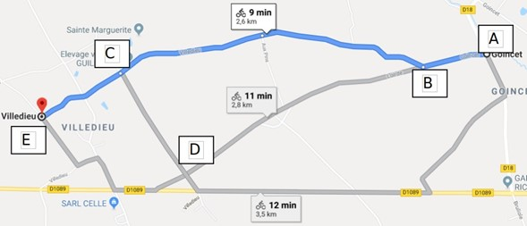
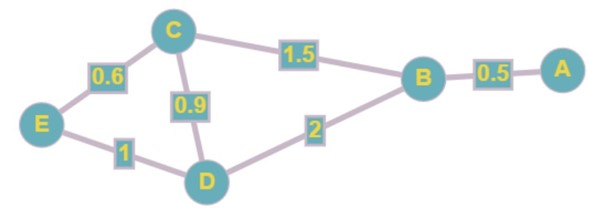

# Calcul d'itinéraires

### Introduction

Comme vous avez pu le constater quand vous avez travaillé sur Open Street Map (ou autre), il est possible d'afficher les voies de communication (principalement les routes). La base de données OSMcontient donc les routes.
En utilisant ces données, il est possible de développer des outils capables de calculer des itinéraires routiers ou piétons (comme le propose les logiciels "GPS" : Waze, ViaMichelin, Mappy, Google maps...)
Vous renseignez votre lieu de départ et votre lieu d'arrivée, puis le logiciel calcule votre itinéraire.
Ce calcul d'itinéraire repose sur des algorithmes relativement complexes, par exemple
l'algorithme de Dijkstra qui permet d'obtenir le plus court chemin entre deux points.

### Algorithme de Dijkstra et parcours de graphe

Sans entrer dans les détails, l'algorithme de Dijkstra travaille sur des graphes (chaque ville est un sommet du graphe et chaque route est une arête du graphe)

Il existe bien sur de nombreux sites et applications pour trouver le meilleur itinéraire qui peut changer en cours de route en fonction de l’état de la circulation.



L’application nous propose plusieurs solutions, dont une qui est la plus rapide et ici une qui est la plus courte.

> **Activité 1**
> 
> Donner les différents chemins possibles ( en utilisant les lettres) 
> 
> ```html
> #### mettre les différents chemins ici ###
> ```

Oui mais comment trouver le plus court des chemins possibles ?

Il est possible de modéliser un réseau routier à l’aide d’un graphe :



Chaque embranchement ou changement de direction est modélisé par un sommet, et une arête correspond à une voix de circulation. Le nombre correspond à la distance ( en km par exemple) qui sépare deux sommets.

> **Activité 2**
> 
> Donner la longueur des différents chemins pour aller de A à E
> 
> ```html
> #### longueurs des différents chemins ####
> ```

Plutôt que de calculer à la main les longueurs des différents chemins afin de trouver le plus court, nous l'algorithme de Dijkstra en ligne.

> **Activité 3**
> 
> Rendez-vous sur : [Create Graph online and find shortest path or use other algorithm](https://graphonline.ru/en/)
> 
> Faire **graph/import from file** pour charger le fichier : **graph_trajet.graphml** présent dans votre dossier de travail.
> 
> Vous trouverez le même graphe que précédemment !
> 
> Cette application permet de trouver le plus court chemin entre deux points, pour cela :
> 
> * Sélectionner le point de départ (A)
> 
> * Sélectionner le point d'arrivée (E)
> 
> * Faire Algorithm/Find shorted path using Dijkstra algo.
> 
> * Noter le chemin trouvé
> 
> ```html
> Le chemin trouvé est #### votre réponse ici ####
> ```

Pour en savoir plus sur l'algorithme de Dijkstra, vous pouvez visionner les vidéos suivantes : 

* https://www.youtube.com/watch?v=MybdP4kice4

* https://youtu.be/JPeCmKFrKio

### Calculer un itinéraire à partir d'une application Web

Prenons l'air et direction les caps !

> **Activité 4**
> 
> Rendez-vous sur : [OpenRouteService route planner](https://maps.openrouteservice.org/)
> 
> Tracer un itinéraire à pied du **cap gris nez** au **cap blanc nez**
> 
> Utiliser les fonctionalités du site pour compléter les informations ci-dessous :
> 
> ```html
> Distance du trajet :
> Durée du trajet :
> Altitude maximale :
> Cumul de dénivellé (montée) :
> Cumul de dénivellé (descente) :
> ```
> 
> Enregistrer le trajet sous le **format GPX**  et ouvrir le fichier gpx avec notepad++ pour observer les informations contenues.

### Itinéraire calculé sous python avec le module pyroutelib3

La bibliothèque **pyroutelib3.py** permet de calculer des itinéraires avec python.

> **Activité 5**
> 
> Ouvrez le programme itineraire.py avec Thonny
> 
> Renseigner les coordonnées des points de départ et d'arrivée
> 
> Lancer le programme (soyez patient !)
> 
> Observez la carte obtenue avec l'itinéraire
> 
> Dans le shell, taper routeLatLons puis valider afin d'observer le contenu de la variable routeLatLons.
> 
> A quoi correspond le contenu de cette variable ?
> 
> ```html
> ### votre réponse ici ###
> ```
> 
> Refaire la même démarche en recherchant un itinéraire piéton entre le lycée et votre domicile.

# 
